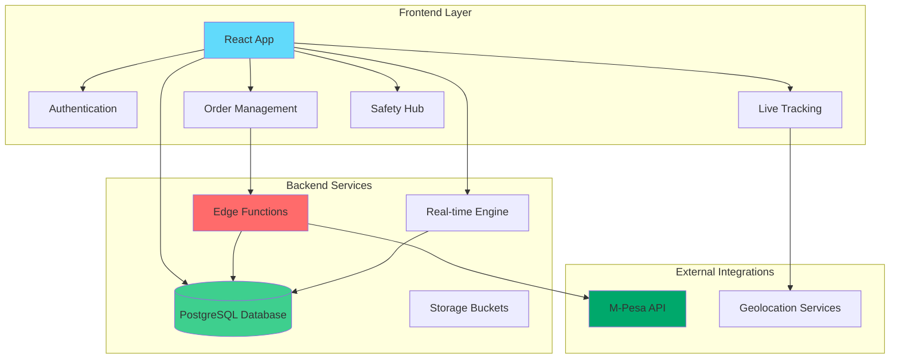
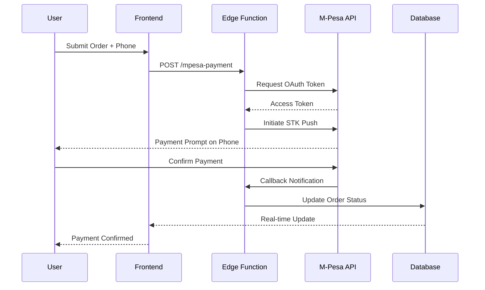
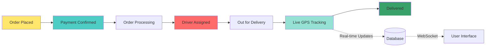
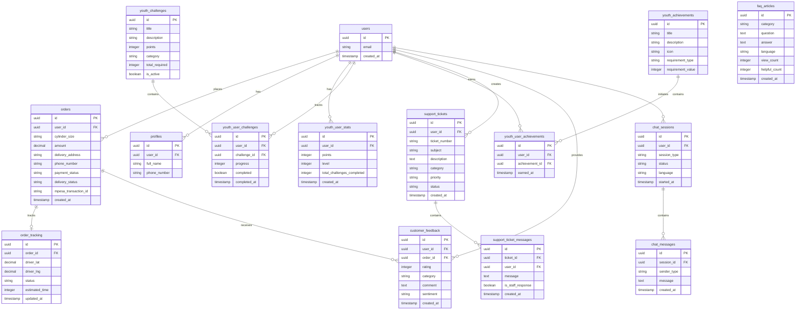

# 🔥 Green Wells LPG - Next-Generation Gas Delivery Platform

<div align="center">

**Revolutionizing LPG delivery through real-time tracking, instant payments, and predictive safety systems**

[](https://www.typescriptlang.org/)
[](https://reactjs.org/)
[](https://supabase.com/)

[Live Demo](https://green-wells-connect.vercel.app/) • [Documentation](#documentation) • [Contributing](#contributing)

</div>

---

## 📸 Platform Screenshots

### Landing Page


### Customer Support Hub


### Feedback & Reviews System


### Rewards Marketplace


### Team Challenges


---

## 🎯 Vision & Value Proposition

Green Wells LPG transforms the traditional gas delivery industry by providing:

- **⚡ Instant Ordering**: From selection to payment in under 60 seconds
- **📍 Real-Time Tracking**: GPS-powered delivery monitoring with ETA updates
- **💳 Seamless Payments**: Integrated M-Pesa STK Push for frictionless transactions
- **🛡️ Safety First**: Comprehensive safety protocols and emergency guidelines
- **🔄 Smart Logistics**: Optimized routing and predictive demand forecasting

---

## 🏗️ System Architecture



---

## 💰 M-Pesa Payment Flow



---

## 📍 Real-Time Tracking System



---

## 🚀 Key Features

### 🔐 Authentication & Security
- Secure email/password authentication
- Auto-confirmed signups for seamless onboarding
- Row-Level Security (RLS) policies on all database tables
- Session management with automatic token refresh

### 📦 Smart Order Management
- Multiple cylinder size options (6kg, 13kg, 50kg)
- Real-time geolocation for accurate delivery addresses
- Flexible time slot selection
- Instant order confirmation via M-Pesa

### 📡 Live Tracking Dashboard
- Real-time driver location on interactive map
- Dynamic ETA calculations
- Order status updates (Processing → Assigned → Out for Delivery → Delivered)
- Historical order tracking

### 🛡️ Safety Hub
- Comprehensive safety guidelines
- Emergency contact information
- Leak detection protocols
- Proper storage instructions
- Fire safety measures

### ✨ Youth Energy Hub
- **Gamified Learning**: Interactive challenges and achievements to engage Gen Z and millennials
- **Social Integration**: Share energy-saving tips and achievements on social media platforms
- **Peer-to-Peer Competition**: Leaderboard system to compete with fellow energy innovators
- **Educational Content**: Video tutorials, articles, and quizzes about sustainable LPG usage
- **Community Forum**: Connect with other youth to discuss energy efficiency and sustainability
- **Progress Tracking**: Points, levels, and badges to reward eco-friendly behavior
- **Challenges**: Complete various challenges related to ordering, education, social sharing, and referrals

### 🎧 Customer Support Hub
- **Intelligent Help Desk**: Priority-based ticket system with auto-numbering and status tracking
- **AI-Powered Chat**: 24/7 instant support with intelligent AI responses in multiple languages
- **Multilingual Support**: Full platform support in English and Swahili with easy language switching
- **Knowledge Base**: Searchable FAQ database with helpful voting system
- **Ticket Management**: Create, track, and manage support requests with real-time updates
- **Support Categories**: Specialized support for orders, payments, delivery, technical issues, and safety

### ⭐ Feedback & Reviews
- **Customer Feedback Dashboard**: Comprehensive feedback collection and analytics
- **Star Ratings**: 5-star rating system for services, delivery, products, and overall experience
- **Sentiment Analysis**: Automatic categorization of feedback as positive, neutral, or negative
- **Feedback Analytics**: Real-time statistics on customer satisfaction and trends
- **Category-Based Reviews**: Targeted feedback for different aspects of service
- **Public Reviews**: Share experiences to help build community trust

### 🎁 Rewards Marketplace
- **Points Redemption System**: Turn loyalty points into real rewards
- **Delivery Discounts**: Get discounts on future deliveries (500 points for 20% off)
- **Free Delivery Rewards**: Redeem points for free delivery (1,000 points)
- **Premium Benefits**: Unlock premium membership benefits (2,500 points for 30 days)
- **Exclusive Perks**: Access to special offers and limited-time rewards
- **Real Value**: All rewards provide tangible benefits to customers

### 🏆 Team Challenges
- **Team Creation**: Form teams with friends, family, or community members
- **Collaborative Competitions**: Work together to complete team challenges
- **Team Leaderboards**: Compete against other teams for top positions
- **Bonus Points**: Earn extra points through team achievements
- **Exclusive Team Rewards**: Special rewards available only to top-performing teams
- **Social Engagement**: Build community through collaborative challenges

### 🚚 Driver App
- **Dedicated Driver Interface**: Specialized dashboard for delivery personnel
- **Route Optimization**: Smart routing algorithms to minimize delivery time and fuel costs
- **Order Management**: View assigned deliveries with customer details and locations
- **GPS Navigation**: Integrated mapping for efficient route planning
- **Status Updates**: Real-time delivery status updates for customer tracking
- **Delivery Confirmation**: Digital proof of delivery with customer signatures

### 📦 Warehouse Management
- **Inventory Tracking**: Real-time monitoring of cylinder stock levels
- **Automated Reordering**: Smart alerts when inventory reaches minimum thresholds
- **Stock Analytics**: Visual dashboards showing inventory trends and patterns
- **Supplier Management**: Track orders from suppliers and delivery schedules
- **Multi-Location Support**: Manage inventory across multiple warehouse locations
- **Audit Trail**: Complete history of inventory movements and adjustments

### 👨‍💼 Admin Dashboard
- **Comprehensive Analytics**: Bird's-eye view of all platform operations
- **Order Management**: Monitor and manage all customer orders
- **User Management**: View and manage customer accounts and permissions
- **Performance Metrics**: Track KPIs including delivery times, customer satisfaction, and revenue
- **Report Generation**: Export data and generate custom reports
- **System Configuration**: Manage platform settings and configurations

### 💬 Floating Chat Assistant
- **Always Available**: Floating chat widget accessible from any page
- **Instant Support**: Quick access to AI-powered assistance without leaving your current page
- **Persistent Sessions**: Continue conversations as you navigate through the platform
- **Minimizable Interface**: Compact design that doesn't interfere with your workflow
- **Smart Responses**: Context-aware AI providing relevant help based on your current page

---

## 🛠️ Technology Stack

### Frontend
- **React 18** - Modern UI library with hooks
- **TypeScript** - Type-safe development
- **Tailwind CSS** - Utility-first styling with custom design system
- **Shadcn/ui** - High-quality component library
- **React Router** - Client-side routing
- **React.lazy()** - Route-based code splitting with lazy loading
- **TanStack Query** - Powerful data fetching and caching
- **PWA Support** - Progressive Web App with offline capabilities
- **Code Splitting** - Optimized bundle sizes with dynamic imports

### Performance & Optimization
- **Lazy Loading** - Route-based code splitting for faster initial loads
- **Error Boundaries** - Graceful error handling with recovery options
- **Service Worker** - Offline support and caching strategy
- **Optimized Assets** - Long-term caching for static resources
- **Bundle Size** - Main bundle reduced to ~544KB (55% reduction)

### Backend
- **PostgreSQL** - Relational database with real-time capabilities
- **Supabase Auth** - User authentication and session management
- **Edge Functions (Deno)** - Serverless backend logic
  - `mpesa-payment` - Handles M-Pesa STK Push payment initiation
  - `mpesa-callback` - Processes M-Pesa payment callbacks and order updates
  - `ai-chat` - Powers AI-driven customer support chat with multilingual capabilities
- **Real-time Subscriptions** - WebSocket-based live updates
- **Row Level Security** - Database-level access control

### Integrations
- **M-Pesa Daraja API** - Mobile money payments
- **Geolocation API** - Address detection and mapping

---

## 📊 Database Schema



---

## 🚦 Getting Started

### Prerequisites
- Node.js 18+ and npm
- Git

### Installation

```bash
# Clone the repository
git clone <https://github.io/mwakidenis/Green-Wells-LPG-System>
cd <Green-Wells-LPG-System>

# Install dependencies
npm install

# Start development server
npm run dev
```

The app will be available at `http://localhost:5173`

### Environment Setup

All environment variables are automatically configured through Lovable Cloud:
- `VITE_SUPABASE_URL` - Supabase project URL
- `VITE_SUPABASE_PUBLISHABLE_KEY` - Anon key for client-side operations
- `VITE_SUPABASE_PROJECT_ID` - Project identifier

M-Pesa credentials are securely stored as backend secrets:
- `MPESA_CONSUMER_KEY`
- `MPESA_CONSUMER_SECRET`
- `MPESA_PASSKEY`
- `MPESA_SHORTCODE`

### Building for Production

```bash
# Build the application
npm run build

# Preview the production build locally
npm run preview
```

The build output will be in the `dist/` directory.

### Deployment

#### Vercel (Recommended)

The application is optimized for deployment on Vercel:

1. Push your code to GitHub
2. Import the project in Vercel
3. Vercel will automatically detect the Vite configuration
4. Set your environment variables in Vercel dashboard
5. Deploy!

**Important**: The `vercel.json` configuration file is included to handle client-side routing. This ensures that refreshing non-root pages doesn't result in 404 errors. The rewrite rule redirects all routes to `index.html`, allowing React Router to handle the routing. Note: If you plan to add API routes in the future, you'll need to exclude them from this rewrite rule.

#### Other Platforms

For deployment on other platforms (Netlify, AWS Amplify, etc.), ensure your hosting platform:
- Serves the `dist/` directory as the root
- Redirects all routes to `index.html` for client-side routing
- Supports environment variables for Supabase configuration

#### PWA Assets

To enable full PWA functionality, add icon files to `public/images/`:
- icon-72x72.png
- icon-96x96.png
- icon-128x128.png
- icon-144x144.png
- icon-152x152.png
- icon-192x192.png
- icon-384x384.png
- icon-512x512.png

These icons are referenced in `manifest.json` for the Progressive Web App features.

### Available Routes

The application includes the following pages and routes:

**Public Routes:**
- `/` - Landing page with product information and sign-up
- `/login` - User authentication page

**Protected Routes (requires authentication):**
- `/dashboard` - User dashboard with order history and account overview
- `/order` - Place new LPG cylinder orders
- `/tracking` - Real-time order tracking with GPS location
- `/safety` - Safety hub with guidelines and emergency protocols
- `/youth-hub` - Gamified youth energy hub with challenges and achievements
- `/rewards` - Rewards marketplace for redeeming loyalty points
- `/teams` - Team challenges and collaborative competitions
- `/support` - Customer support hub with tickets, live chat, and FAQ
- `/feedback` - Feedback dashboard for ratings and reviews
- `/driver` - Driver application for delivery personnel
- `/warehouse` - Warehouse management system for inventory control
- `/admin` - Admin dashboard for platform management (admin access required)

---

## 🎨 Design System

The application uses a semantic token-based design system for consistent theming:

```css
/* Core color tokens */
--primary: HSL value for brand color
--secondary: HSL value for secondary actions
--accent: HSL value for highlights
--background: Adaptive background color
--foreground: Adaptive text color

/* Gradients */
--gradient-primary: Brand gradient
--gradient-subtle: Subtle backgrounds

/* Shadows */
--shadow-elegant: Elevation effects
--shadow-glow: Accent highlights
```

All components use semantic tokens rather than hardcoded colors for maintainability and theme flexibility.

---

## 🔮 Future Improvements & Competitive Edge

### Phase 1: Enhanced User Experience (Q2 2025)
- [ ] **AI-Powered Demand Forecasting** - Predict gas consumption patterns and proactive refill reminders
- [ ] **Voice Ordering** - "Hey Green Wells, order a 13kg cylinder for delivery at 5 PM"
- [ ] **Subscription Plans** - Auto-delivery at customizable intervals with discounted pricing
- [x] **Multi-Language Support** - ✅ Implemented: Full platform support in English and Swahili

### Phase 2: Smart Logistics (Q3 2025)
- [x] **Route Optimization Algorithm** - ✅ Implemented: Smart routing to minimize delivery time and fuel costs
- [ ] **Dynamic Pricing** - Real-time pricing based on demand, distance, and time
- [x] **Driver Mobile App** - ✅ Implemented: Dedicated app for delivery personnel with optimized routes
- [x] **Warehouse Management System** - ✅ Implemented: Inventory tracking and automated reordering

### Phase 3: Ecosystem Expansion (Q4 2025)
- [ ] **IoT Gas Monitoring** - Smart sensors on cylinders to detect low levels and auto-order
- [ ] **Corporate B2B Portal** - Bulk ordering for restaurants, hotels, and businesses
- [ ] **Carbon Credit Integration** - Track and reward eco-friendly LPG usage
- [x] **Loyalty & Rewards Program** - ✅ Implemented: Points-based system with referral bonuses

### Phase 4: Industry Leadership (2026)
- [ ] **Blockchain-Based Supply Chain** - Transparent tracking from refinery to consumer
- [ ] **Predictive Maintenance** - AI alerts for cylinder inspection and maintenance schedules
- [ ] **Marketplace Model** - Connect multiple LPG suppliers with consumers
- [ ] **Safety AI Assistant** - Computer vision for leak detection and safety compliance
- [ ] **Green Energy Integration** - Bundle LPG with solar and biogas solutions

### Competitive Advantages

#### 1. **Data-Driven Operations**
- Predictive analytics for inventory management
- Customer behavior insights for personalized marketing
- Real-time performance dashboards for operational efficiency

#### 2. **Safety as a Core Differentiator**
- First LPG platform with comprehensive safety education
- AI-powered safety audits and compliance tracking
- Emergency response integration with local authorities

#### 3. **Seamless Payment Experience**
- Multiple payment methods (M-Pesa, card, bank transfer)
- Buy-now-pay-later partnerships for larger orders
- Corporate invoicing and automated billing

#### 4. **Environmental Leadership**
- Carbon footprint tracking for deliveries
- Incentivize cylinder recycling programs
- Partner with environmental organizations

#### 5. **Community Building**
- Customer review and rating system
- Social sharing for referral growth
- Educational content on safe LPG usage

---

## 🏆 Why Green Wells Wins

| Traditional LPG Delivery | Green Wells LPG |
|-------------------------|-----------------|
| Phone call ordering | One-tap mobile ordering |
| Cash on delivery | Instant mobile payment |
| Unpredictable wait times | Real-time ETA tracking |
| Limited safety info | Comprehensive safety hub |
| Manual inventory | Automated demand forecasting |
| Fragmented experience | End-to-end digital platform |

---

## 📈 Business Metrics to Track

### Key Performance Indicators (KPIs)
- **Order Completion Rate** - % of orders successfully delivered
- **Average Delivery Time** - Time from order to delivery
- **Customer Satisfaction Score** - Post-delivery ratings
- **Payment Success Rate** - M-Pesa transaction completion
- **Customer Retention** - Monthly active users returning
- **Driver Efficiency** - Orders per driver per day

### Growth Metrics
- **Customer Acquisition Cost (CAC)**
- **Lifetime Value (LTV)**
- **Monthly Recurring Revenue (MRR)**
- **Churn Rate**
- **Net Promoter Score (NPS)**

---

## 🤝 Contributing

We welcome contributions! Please follow these steps:

1. Fork the repository
2. Create a feature branch (`git checkout -b feature/AmazingFeature`)
3. Commit your changes (`git commit -m 'Add some AmazingFeature'`)
4. Push to the branch (`git push origin feature/AmazingFeature`)
5. Open a Pull Request

### Code Style
- Follow TypeScript best practices
- Use semantic naming conventions
- Write meaningful commit messages
- Add comments for complex logic
- Ensure all components use the design system tokens

---

## 📝 Documentation

### Project Documentation
Located in the `docs/` directory:
- **CUSTOMER_SUPPORT.md** - Complete technical documentation for customer support features
- **SUPPORT_QUICK_START.md** - Quick reference guide for using support features
- **YOUTH_ENERGY_HUB.md** - Detailed documentation for the Youth Energy Hub gamification system
- **YOUTH_HUB_QUICK_REFERENCE.md** - Quick guide for Youth Hub features
- **PROJECT_SUMMARY.md** - Comprehensive project overview and feature list
- **IMPLEMENTATION_SUMMARY.md** - Technical implementation details and quality metrics
- **GREEN_WELLS_PRESENTATION.md** - Full project presentation deck
- **PRESENTATION_QUICK_REFERENCE.md** - Quick presentation reference guide

### External Resources
- [Supabase Guides](https://supabase.com/docs)
- [M-Pesa API Documentation](https://developer.safaricom.co.ke/)
- [React Best Practices](https://react.dev/)

---

## 🔒 Security

- All API keys are stored as encrypted secrets
- Row-Level Security enabled on all database tables
- HTTPS-only communication
- Regular security audits recommended
- M-Pesa transactions use OAuth 2.0

To report a security vulnerability, please email: security@greenwells.co.ke

---

## 📜 License

This project is licensed under the MIT License - see the [LICENSE](LICENSE) file for details.

---

## 🙏 Acknowledgments

- UI components from [shadcn/ui](https://ui.shadcn.com/)
- Backend powered by [Supabase](https://supabase.com/)
- Payment integration via [M-Pesa Daraja API](https://developer.safaricom.co.ke/)

---

## 📞 Contact & Support

- **Website**: [Coming Soon]
- **Email**: support@greenwells.co.ke
- **Twitter**: [@GreenWellsLPG]
- **LinkedIn**: [Green Wells LPG]

---

<div align="center">

**⭐ Star this repo if you find it useful OR**[](https://wa.me/254798750585)


Made with ❤️ by the **Mwaki Denis**

</div>
